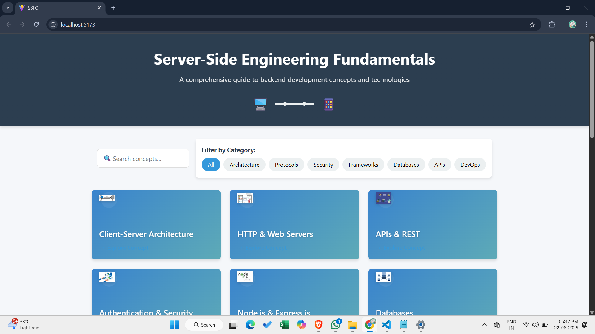
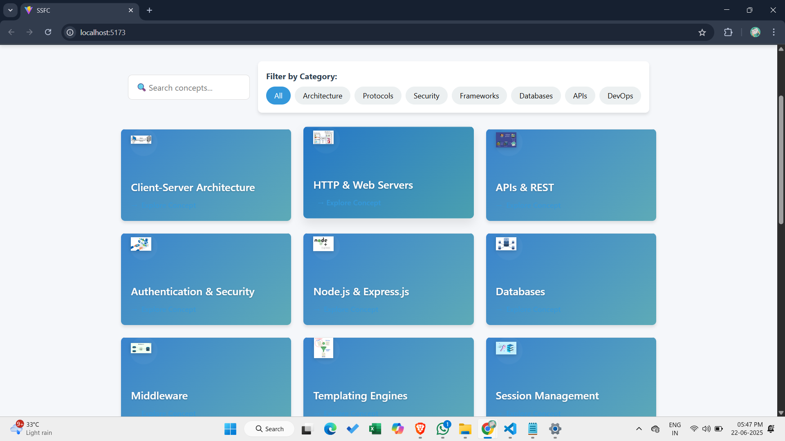
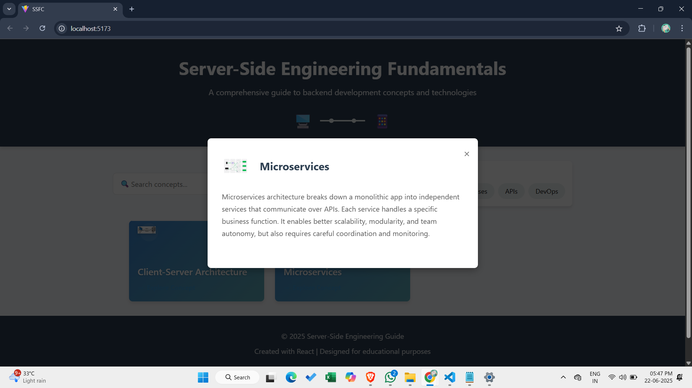

# Server-Side Engineering Concepts Explorer
 
 

An interactive dashboard for learning and exploring fundamental server-side engineering concepts with React.

## Features

- **Searchable Concept Library**: Filter through 20+ server-side concepts
- **Category Filtering**: Organize by architecture, protocols, security, etc.
- **Interactive Cards**: Detailed concept exploration
- **Responsive Design**: Works on desktop and mobile devices
- **Modern UI**: Clean interface with smooth animations

## Screenshots

## Main Dashboard  

## Concept Modal  

## Content Modal  

## Filtered View  

## Technologies Used

- React 18 (with Hooks)
- CSS Modules for styling
- Vite.js for development/build
- Framer Motion (for animations)
- React Icons
